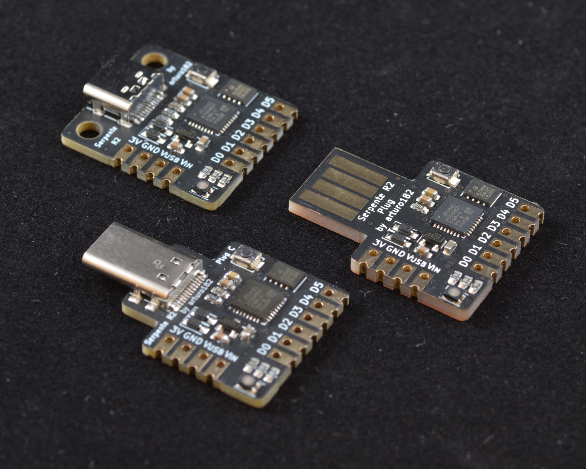

# Serpente

A tiny and cheap CircuitPython development board, perfect for quick projects and prototyping!

Comes in three versions: Female USB Type-C, Male USB Type-C, and bare PCB USB A plug.

# Technical details

- ATSAMD21E18A 32-bit Cortex-M0+ running at 48MHz
- 256KB flash and 32KB RAM
- 4MB Flash for storing files and CircuitPython code
- 6 highly customizable GPIOs
- 250mA LDO
- 3.3V logic and power
- Powered either from USB or external source
- User-controlled RGB LED
- Breadboardable headers
- Castellated edges, can be used as a module
- Mounting holes on the Female Type-C board

# Documentation

For more information visit https://serpente.solder.party/
